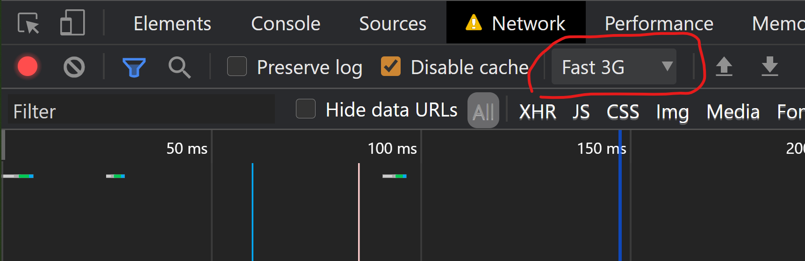

# integrating JavaScript in HTML ...

- `<script>`-Tag ([Spec](https://html.spec.whatwg.org/multipage/scripting.html#scripting-3))
- attributes
  - src
  - type
    - since HTML5 for `<script>`-Tag defaults to `"text/javascript"`
    - `"module"` is also possible to work with ES2015 Modules in JS
      - they come always strict mode
      - default for modules is deferred loading mechanism
  - defer
  - async

## ... as inline-script

```html
<script>
    console.log("I am an inline-script")
</script>
```

## ... as external resource

```html
<script src="myScript.js"></script>
```

### deferred

```html
<script src="myScript.js" defer></script>
```

### async

```html
<script src="myScript.js" async></script>
```

## type

# examples

- in [index.html](index.html) there are four scripts integrated
- using following JS-files
  - [defer1.js](defer1.js) [~ 13.5 kb]
  - [defer2.js](defer2.js) [32 byte]
  - [async1.js](async1.js) [~ 13.5 kb]
  - [async2.js](async2.js) [32 byte]
- enabling of throttling in Chrome DevTools to e.g. `Fast 3G`



## defer-examples

- defer-loaded scripts keep the order, so even when the first script is larger, it is getting executed before the second script

```html
<head>
<script src="defer1.js" defer></script>
<script src="defer2.js" defer></script>
</head>
```

```js
hello from defer1
hello from defer2
```

## async-examples

- async-loaded scripts do not keep the order they are integrated in HTML, as soon as one script is completely loaded it is getting executed, so following output in the Chrome DevTools should be visible

```html
<head>
<script src="async1.js" async></script>
<script src="async2.js" async></script>
</head>
```

```js
hello from async2
hello from async1
```

- `async2` is loaded faster than `async1` and has been executed earlier
